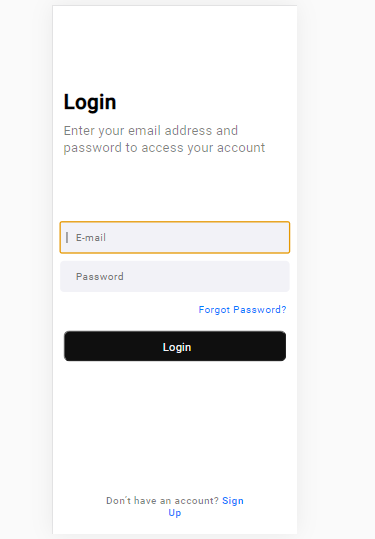

# Project-Login

   
 > Interface de login para aplicativo, criado com objetivo de melhorar minhas habilidades no html e css.

### Ajustes e melhorias

O projeto ainda está em desenvolvimento e as próximas atualizações serão voltadas nas seguintes tarefas:

- [ ] Tarefa 1 - Atribuir funções ao botões com JS
- [ ] Tarefa 2 - Criar link no git pages
- [ ] Tarefa 2 - Adaptar para versão web

